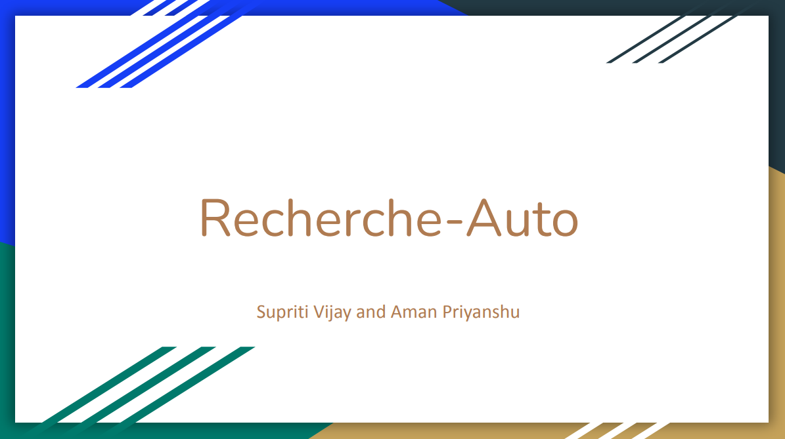
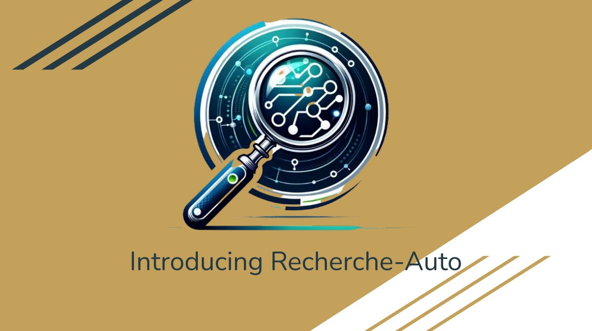

# Recherche-Auto

Recherche-Auto, powered by state-of-the-art LLM - Claude, revolutionizes web-based news research by organizing and encoding data into personalized knowledge graphs. Leveraging LLMs for auto error correction and to dynamically redirect searches upon hitting a dead-end, it's complemented by adaptable retrieval automated generation (RAG) systems for targeted information discovery, ensuring precise and relevant web search outcomes tailored to individual needs. Check out the [Demo!](https://recherche-auto.streamlit.app/)

## The Problem

In today's fast-paced world, professionals and researchers grapple with information overload. The vast, unorganized data available online leads to inefficiencies, with significant time spent on searching for relevant information, often ending in frustration and dead-ends.

- Every day, over **2.5 quintillion bytes of data** are created.
- Professionals spend about 28% of their workday managing emails, contributing to the vast information landscape they navigate daily.
- The inefficiency in web search research leads to an estimated **annual loss of 4.8 Billion USD** due to lost productivity.

## Our Solution: Recherche-Auto

### Features

- **Advanced Technology**: Utilizes the latest LLM technology, Claude Opus, for dynamic and precise news research.
- **Intelligent Error Correction**: Automatically corrects errors and redirects searches to avoid dead-ends.
- **Tailored News Discovery**: Implements RAG systems for targeted, relevant results and generates knowledge graphs from Opus responses.

### Impact

- **Efficiency**: Reduces research time by 80%, saving at least $15,200 per employee per year.
- **Economic Benefit**: Estimated total savings of up to **3.8 Billion USD**.
- **Enhanced Learning**: Minimizes errors and refines search outcomes for better decision-making.

## The Team

- **Supriti Vijay**: Technical staff at Adobe's Digital Experience team. Former AAAI Undergraduate Consortium Scholar and Adobe Women-in-Tech Scholar. Currently working with industrial research at Adobe and academic research in conjunction with CMU, UWash, and Rochester University. 
- **Aman Priyanshu**: Graduate student in Privacy Engineering & Artificial Intelligence at Carnegie Mellon University. Previously an AAAI Undergraduate Consortium Scholar and Winner of CalHacks by UC Berkeley.

## Try It Out

Explore Recherche-Auto and experience the future of web-based news research:
[Recherche-Auto Demo](https://recherche-auto.streamlit.app/)
[Github](https://github.com/AmanPriyanshu/Recherche-Auto)
